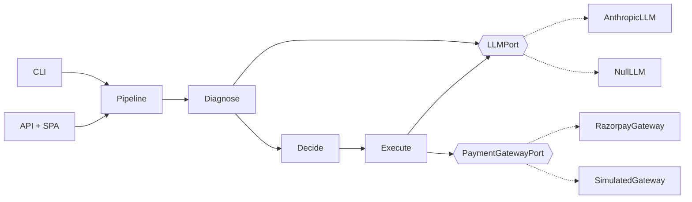
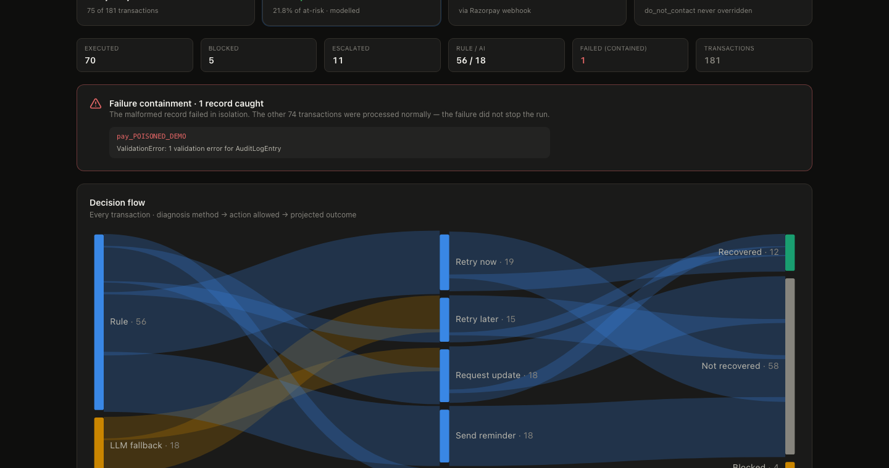

<h1 align="center">Revenue Recovery Agent</h1>

<p align="center">
  An AI agent that diagnoses <em>why</em> a Razorpay payment failed and drives the
  right recovery — under compliance limits enforced in code, with every decision
  on an audit trail.
</p>

<p align="center">
  
  
  
  
  
</p>

<p align="center"><strong>Razorpay AI Buildathon · Track 03 — AI Revenue Recovery</strong></p>

---

## The problem

Payments fail for a dozen reasons — an expired card, a bank auth decline, a
dropped OTP, a customer who closes the tab mid-checkout. Most of that revenue is
genuinely recoverable if something diagnoses the cause and takes the right next
action fast. Most merchants don't have that something.

## What this does

Given a batch of transactions, the agent:

1. **Detects** which are failed or abandoned, and how much revenue is at risk.
2. **Diagnoses** the root cause from Razorpay's structured `error` object —
   deterministic rules for the clear-cut cases, the LLM for the one genuinely
   ambiguous one.
3. **Decides** the recovery action under three hard limits (`do_not_contact` is
   absolute, retries capped per method, contact capped per customer / 48 h).
4. **Executes** — a fresh Razorpay test-mode payment link, or a customer message
   drafted by Claude / a template.
5. **Accounts** for every decision on an audit trail, projects revenue
   recovered, and exposes a `payment_link.paid` webhook that turns a projection
   into a confirmed number.

<p align="center">
  
</p>

---

## Run it

```bash
make setup            # venv + editable install + build the dashboard  (needs Python 3.11+, Node 20+)
cp .env.example .env  # optional — it runs fully without credentials
make demo             # run the pipeline, serve the dashboard at http://127.0.0.1:8000
```

No `.env`? It still runs end-to-end: Razorpay links become labelled simulations,
the ambiguous-decline diagnosis takes a conservative deterministic fallback, and
messages use templates. Add keys and those paths go live with no code change —
every entry point prints which is which.

**Docker:**

```bash
docker compose up --build      # dashboard + API on :8000
```

**Just the CLI:**

```bash
revenue-recovery run --count 180 --seed 42          # writes data/pipeline_report.json
revenue-recovery run --inject-failure               # exercise the containment boundary
revenue-recovery report                             # re-print the last run
revenue-recovery serve                              # API + dashboard
```

---

## Architecture

Ports and adapters. The recovery logic knows nothing about Razorpay, Anthropic,
HTTP, or JSON — it talks to `typing.Protocol` ports that adapters implement, so
it is unit-testable with no network and swappable without a rewrite.



Full write-up: [`docs/ARCHITECTURE.md`](docs/ARCHITECTURE.md) ·
design rationale: [`docs/DECISIONS.md`](docs/DECISIONS.md).

```
src/revenue_recovery/
├── domain/        pure entities, value objects, enums, errors  (no I/O)
│   ├── money.py       exact-Decimal ₹ with Indian digit grouping
│   ├── models.py      Transaction / ErrorDetail  (strict Pydantic)
│   └── results.py     PipelineReport — every headline number derived here
├── ports/         LLMPort, PaymentGatewayPort  (Protocols)
├── adapters/      AnthropicLLM · NullLLM · RazorpayGateway · SimulatedGateway · synthetic
├── services/      diagnosis · recovery · execution · pipeline · strategies · outcomes
├── api/           FastAPI app + built SPA
└── cli.py         Typer:  run / report / serve / demo

frontend/          React + Vite + Tailwind dashboard
tests/             unit · integration · e2e   (hermetic; 62 tests, 91% cov)
```

---

## The AI-judgment split

`services/diagnosis.py` maps **7 of 8** failure reasons to an action via a fixed
rule table — each has exactly one sane response regardless of context, so an LLM
call there would only add latency and a hallucination surface. Routing to the
LLM is **confidence-weighted**: a reason goes to the model when it is in the
ambiguous set (a bare bank decline — retry vs. wait vs. switch method depends on
attempt history and amount) or when the matched rule's confidence is below a
floor. The model returns a *recommendation with reasoning*; it never decides
retries or stops — `RecoveryEngine` does, deterministically.

On the seed-42 batch: **56/74 (76%) resolved by rule, 18/74 routed off the rule
table.** With no Anthropic key those 18 take the conservative fallback
(`method="llm_fallback"`); with a key they hit Claude (`method="llm"`).
`revenue-recovery run` prints the split.

## The stopping rules

Enforced in `services/recovery.py`, not just documented:

| Rule | Behaviour |
|---|---|
| `do_not_contact` is absolute | No code path turns a compliance stop into an action. A property-style test regenerates a fresh 400-txn batch on a new seed and asserts this holds end-to-end. |
| Retries capped **per method** | `card` allows 3 attempts, `netbanking` 2 (usually a bank outage). Past the cap → escalate to `request_update`, suggest the method's alternate rail. |
| Contact capped **per customer** | ≤ 2 messages / rolling 48 h across all the customer's transactions. Silent retries never count. The engine is stateful and time-ordered, so the cap is enforced against real history. |

## Failure containment

`revenue-recovery run --inject-failure` adds one record with a corrupted amount
(bypassing model validation, as bad upstream data does). It fails deep in the
executor; the pipeline captures it per-transaction (inside the concurrent
thread pool — see below), records an audit entry for the failure, and **the
rest of the batch is processed normally** — asserted in
`test_poisoned_record_fails_alone_and_the_batch_continues`.

**Speed.** Diagnose and execute run concurrently across the batch; decide stays
sequential in chronological order (the recovery engine is stateful). A live
180-transaction run — ~55 LLM calls + ~35 gateway calls — takes **~8 s**, not
~100 s. Fast enough to trigger from the dashboard or a webhook handler.

<p align="center">
  
</p>

## "Revenue recovered"

A batch has no real customer completing checkout, so conversion is **projected**
— a published probability per action type (`retry_now` 0.45 … `request_update`
0.15), drawn with a per-transaction seed so re-runs match. It is a labelled
modelling assumption. `POST /api/webhooks/razorpay` models the production
replacement: a `payment_link.paid` event flips one entry to *confirmed*, and the
dashboard's confirmed number moves. The webhook simulator on the dashboard does
this live.

---

## API

`revenue-recovery serve` → OpenAPI docs at `/docs`.

| Method | Path | |
|---|---|---|
| `GET` | `/api/health` | credential/liveness status |
| `GET` | `/api/report` | the current `PipelineReport` |
| `POST` | `/api/runs` | run a fresh pipeline `{count, seed, inject_failure}` |
| `POST` | `/api/webhooks/razorpay` | `{event: "payment_link.paid", payment_link_id}` → confirm |

## Development

```bash
make check      # ruff + mypy (strict) + pytest — exactly what CI runs
make fmt        # autofix + format
```

CI runs the backend on Python 3.11 and 3.12, builds the frontend, and
smoke-tests the Docker image. See [`CONTRIBUTING.md`](CONTRIBUTING.md).

## A note on the failure taxonomy

The error shape (`code` / `description` / `source` / `step` / `reason`) mirrors
what Razorpay's API returns. The specific `reason` values in the synthetic
generator are representative examples — cross-check against
<https://razorpay.com/docs/errors/payments/list/> before wiring real flows.
