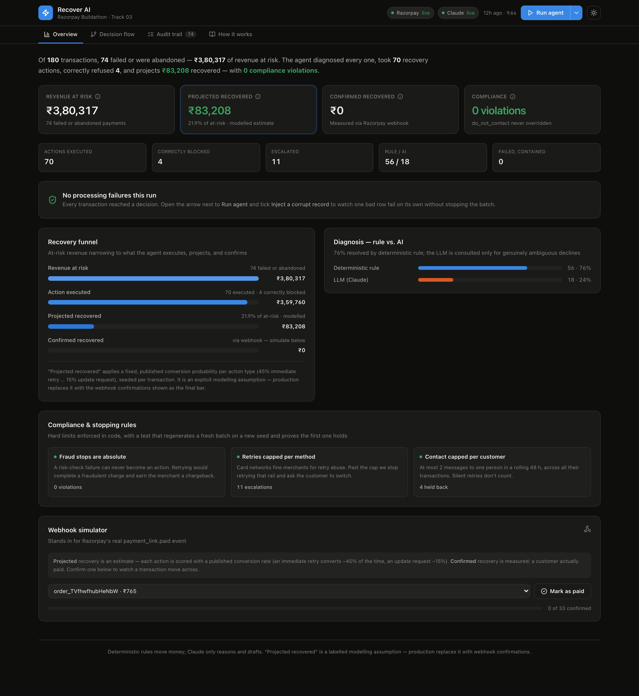
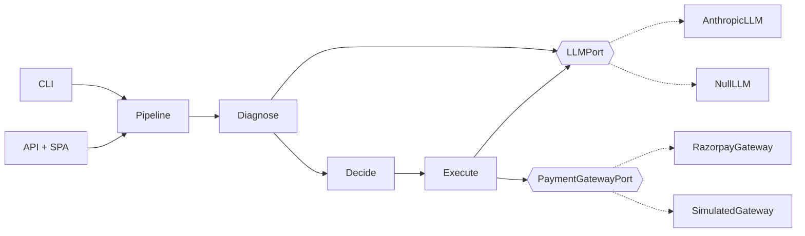

<h1 align="center">Recover AI</h1>

<p align="center">
  An agent that diagnoses <em>why</em> a Razorpay payment failed, drives the
  compliant recovery, and <em>learns</em> — a calibrated conversion model, an
  expected-value gate, and a measured causal lift, not a projection.
</p>

<p align="center">
  
  
  
  
  
</p>

<p align="center"><strong>Razorpay AI Buildathon · Track 03 — AI Revenue Recovery</strong></p>

---

## The problem

Payments fail for a dozen reasons — an expired card, a bank auth decline, a
dropped OTP, a customer who closes the tab mid-checkout. Most of that revenue is
genuinely recoverable if something diagnoses the cause and takes the right next
action fast. Razorpay tells a merchant *that* a payment failed, and gives a raw
error code. It does not decide what to do about each one, price whether chasing
it is worth it, prove the campaign actually worked, or stop before a retry turns
into a chargeback or a spam complaint. Most merchants send one generic "payment
failed" email — or nothing — and eat the rest. Recover AI is the layer in
between: it optimizes the merchant's *net* recovered revenue, not Razorpay's
transaction volume, and it is provider-neutral by construction (see
[Architecture](#architecture)).

## What this does

Given a batch of transactions, the agent:

1. **Detects** which are failed or abandoned, and how much revenue is at risk.
2. **Diagnoses** the root cause from Razorpay's structured `error` object —
   deterministic rules for the clear-cut cases, the LLM for the one genuinely
   ambiguous one.
3. **Decides** the recovery action under hard compliance limits (`do_not_contact`
   absolute, retries capped per method, contact capped per customer / 48 h) and
   an **expected-value gate** — a recovery that isn't worth the cost of chasing
   is skipped.
4. **Executes** — a fresh Razorpay payment object, or a customer message on the
   cheapest deliverable channel.
5. **Accounts** for every decision on an audit trail, and **learns**: a Beta
   posterior per segment moves with each webhook confirmation, a random holdout
   gives a **measured** incremental lift, and the projection becomes calibrated.

<p align="center">
  
</p>

### How it learns

The projected recovery number isn't a constant. A `Beta` posterior per
`action × method × failure reason × amount band` starts at the policy prior and
moves with every `payment_link.paid` webhook (or its N-day absence). Over time
the projection becomes calibrated — the **Learning** tab shows the reliability
diagram and Brier score.

A seeded fraction of would-act transactions is held out as an **untouched
control**. Treatment recovery minus control recovery is the *incremental* lift —
the revenue that would not have come back on its own — reported with a 95%
confidence interval and accrued across runs. That is the number a CFO signs off
on, and it is measured, not modelled.

---

## Run it

```bash
make setup            # venv + editable install + build the dashboard  (needs Python 3.11+, Node 20+)
cp .env.example .env  # optional — it runs fully without credentials
make demo             # run the pipeline, serve the dashboard at http://127.0.0.1:8000
```

No `.env`? It still runs end-to-end: Razorpay links become labelled simulations,
the ambiguous-decline diagnosis takes a conservative deterministic fallback, and
messages use templates. Add keys and those paths go live with no code change —
every entry point prints which is which.

**Docker:**

```bash
docker compose up --build      # dashboard + API on :8000
```

**Just the CLI:**

```bash
recover-ai run --count 180 --seed 42          # writes data/pipeline_report.json
recover-ai run --inject-failure               # exercise the containment boundary
recover-ai run --shadow                       # decide everything, execute nothing
recover-ai backtest history.csv               # replay the policy on real outcomes
recover-ai policy-diff ./a ./b                # diff two policies in shadow
recover-ai report                             # re-print the last run
recover-ai serve                              # API + dashboard
```

---

## Deploy

The whole thing is one container — FastAPI serves the built SPA and the JSON
API on one port. The image **bakes a deterministic demo run at build time**
(no credentials, no external calls), so a fresh deploy shows a populated
dashboard immediately; a deploy with real keys can re-run from the header.

**Render** (free, from [`render.yaml`](render.yaml)): push this repo to GitHub →
Render → **New → Blueprint** → pick the repo. Add `RAZORPAY_KEY_ID`,
`RAZORPAY_KEY_SECRET`, `ANTHROPIC_API_KEY` only if you want the live paths.

**Anything else that runs a Dockerfile** (Railway, Fly.io, Hugging Face Spaces,
Cloud Run): point it at this repo. The container honours `$PORT` and needs no
persistent disk.

### Split deploy (SPA on Vercel, API on Render)

Optional — the single service above is simpler. If you want the SPA on a CDN:

**Vercel** (the dashboard)
- Root Directory: `frontend`
- Build Command: `npm run build` · Output Directory: `dist` · Install: `npm ci`
- Environment variables:
  - `VITE_OUT_DIR` = `dist`
  - `VITE_API_URL` = `https://<your-render-service>.onrender.com`

**Render** (the API) — Docker service, Root Directory blank
- Runtime: Docker · Dockerfile Path: `./Dockerfile` · Health Check Path: `/api/health`
- Build & Start Command: leave blank (the Dockerfile handles both)
- Environment variable: `RECOVERY_CORS_ORIGINS` = `https://<your-app>.vercel.app`
- Optional live keys: `RAZORPAY_KEY_ID`, `RAZORPAY_KEY_SECRET`, `ANTHROPIC_API_KEY`

*(Prefer a native Python service on Render? Root blank, Build
`pip install -e . && cd frontend && npm ci && npm run build`, Start
`uvicorn recover_ai.api.main:app --host 0.0.0.0 --port $PORT`.)*

---

## Architecture

Ports and adapters. The recovery logic knows nothing about Razorpay, Anthropic,
HTTP, or JSON — it talks to `typing.Protocol` ports that adapters implement, so
it is unit-testable with no network and swappable without a rewrite.



Full write-up: [`docs/ARCHITECTURE.md`](docs/ARCHITECTURE.md) ·
design rationale: [`docs/DECISIONS.md`](docs/DECISIONS.md).

```
src/recover_ai/
├── domain/        pure entities, value objects, enums, errors  (no I/O)
│   ├── money.py       exact-Decimal ₹ with Indian digit grouping
│   ├── models.py      Transaction / ErrorDetail  (strict Pydantic)
│   ├── results.py     PipelineReport — every headline number derived here
│   └── policy.py      versioned Policy — every tunable, recorded per decision
├── ports/         LLMPort, PaymentGatewayPort  (Protocols)
├── adapters/      AnthropicLLM · NullLLM · RazorpayGateway · SimulatedGateway · synthetic
├── services/      diagnosis · recovery · execution · pipeline · strategies · outcomes
│                  learning (Beta posteriors + calibration) · economics (EV gate)
│                  incidents · idempotency · webhooks · backtest
├── api/           FastAPI app + built SPA
└── cli.py         Typer:  run / report / serve / demo / backtest / policy-diff

frontend/          React + Vite + Tailwind dashboard
tests/             unit · integration · e2e   (hermetic; 93 tests, 92% cov)
```

---

## The AI-judgment split

`services/diagnosis.py` maps **7 of 8** failure reasons to an action via a fixed
rule table — each has exactly one sane response regardless of context, so an LLM
call there would only add latency and a hallucination surface. Routing to the
LLM is **confidence-weighted**: a reason goes to the model when it is in the
ambiguous set (a bare bank decline — retry vs. wait vs. switch method depends on
attempt history and amount) or when the matched rule's confidence is below a
floor. The model returns a *recommendation with reasoning*; it never decides
retries or stops — `RecoveryEngine` does, deterministically.

On the seed-42 batch: **56/74 (76%) resolved by rule, 18/74 routed off the rule
table.** With no Anthropic key those 18 take the conservative fallback
(`method="llm_fallback"`); with a key they hit Claude (`method="llm"`).
`recover-ai run` prints the split.

## The stopping rules

Enforced in `services/recovery.py`, not just documented:

| Rule | Behaviour |
|---|---|
| `do_not_contact` is absolute | No code path turns a compliance stop into an action. A property-style test regenerates a fresh 400-txn batch on a new seed and asserts this holds end-to-end. |
| Retries capped **per method** | `card` allows 3 attempts, `netbanking` 2 (usually a bank outage). Past the cap → escalate to `request_update`, suggest the method's alternate rail. |
| Contact capped **per customer** | ≤ 2 messages / rolling 48 h across all the customer's transactions. Silent retries never count. The engine is stateful and time-ordered, so the cap is enforced against real history. |

## Failure containment

`recover-ai run --inject-failure` adds one record with a corrupted amount
(bypassing model validation, as bad upstream data does). It fails deep in the
executor; the pipeline captures it per-transaction (inside the concurrent
thread pool — see below), records an audit entry for the failure, and **the
rest of the batch is processed normally** — asserted in
`test_poisoned_record_fails_alone_and_the_batch_continues`.

**Speed.** Diagnose and execute run concurrently across the batch; decide stays
sequential in chronological order (the recovery engine is stateful). A live
180-transaction run — ~55 LLM calls + ~35 gateway calls — takes **~8 s**, not
~100 s. Fast enough to trigger from the dashboard or a webhook handler.


## The three "revenue recovered" numbers, and why they differ

| Number | What it is | Where it comes from |
|---|---|---|
| **Projected** | Each executed action × its learned conversion rate | `services/learning.py` — a `Beta` posterior per segment, seeded per transaction so re-runs match |
| **Confirmed** | Money a customer actually paid | `POST /api/webhooks/razorpay` flips one entry from projected to confirmed and feeds the posterior a real observation |
| **Incremental lift** | Treatment recovery rate minus an untouched holdout control's, 95% CI | `services/pipeline.py::_assign_holdout` + `LearningStore.observe_experiment`, accrued across every run |

A batch demo has no real customer completing checkout, so *projected* and the
holdout's outcomes are both drawn from the learned posterior rather than
observed — that is labelled everywhere it surfaces. Only *confirmed* is ever a
real number, and it is what production ships with: `payment_link.paid` webhooks
replace the projection outright, run over run, with no code change.

## Safety and operations

Built to be run, not just demoed:

- **Idempotent** — every execution carries a key over `(transaction, action,
  policy version)`; a re-run after a crash never double-charges or
  double-messages (`services/idempotency.py`).
- **Verified webhooks** — `RAZORPAY_WEBHOOK_SECRET` set → HMAC-SHA256 checked
  against the raw body before anything is trusted (`services/webhooks.py`).
- **Shadow mode** — `recover-ai run --shadow` decides everything and executes
  nothing, for onboarding a merchant or trying a policy before it's live.
- **Backtestable** — `recover-ai backtest history.csv` replays the policy
  against real historical outcomes and reports the incremental revenue and
  calibration *before* it ever touches a live customer.
- **Diffable policy changes** — `recover-ai policy-diff ./a ./b` runs two
  `policy.toml`s in shadow over the same batch and prints what changes:
  executions, skips, cost, projected recovery.
- **Incident-aware** — a time-concentrated cluster of failures on one rail is
  treated as an infrastructure problem, not 20 recoveries; retries against it
  are deferred (`services/incidents.py`).

---

## API

`recover-ai serve` → OpenAPI docs at `/docs`.

| Method | Path | |
|---|---|---|
| `GET` | `/api/health` | credential/liveness status + whether webhook verification is on |
| `GET` | `/api/report` | the current `PipelineReport` (results, summary, incidents, learning) |
| `GET` | `/api/learning` | posteriors, calibration table, causal experiment, retry timing |
| `POST` | `/api/runs` | run a fresh pipeline `{count, seed, inject_failure, mode: "live"\|"shadow"}` |
| `POST` | `/api/webhooks/razorpay` | `{event: "payment_link.paid", payment_link_id}` → confirm + learn, HMAC-verified when `RAZORPAY_WEBHOOK_SECRET` is set |

## Development

```bash
make check      # ruff + mypy (strict) + pytest — exactly what CI runs
make fmt        # autofix + format
```

CI runs the backend on Python 3.11 and 3.12, builds the frontend, and
smoke-tests the Docker image. See [`CONTRIBUTING.md`](CONTRIBUTING.md).

## Where this stands

**What's genuinely load-bearing, not demo dressing:** the causal holdout with a
95% CI, the expected-value gate, Beta-posterior calibration, HMAC-verified
webhooks, and idempotent execution are the same primitives a production
recovery system needs — they are not hackathon-only shortcuts. Most dunning
tools (Stripe Smart Retries, Chargebee/Recurly's recovery, Razorpay's own
retry logic) optimize *conversion*; few expose a measured incremental-lift
number with a confidence interval, and fewer still gate spend on net expected
value per recovery rather than retrying everything.

**What keeps this a strong buildathon submission rather than a production
platform today:** one gateway (Razorpay) and one LLM vendor behind the ports —
swappable, not yet swapped; JSON-file persistence instead of a real database,
so it doesn't hold up under concurrent multi-tenant write load; no auth or
multi-tenancy; messaging channels (SMS/WhatsApp/email) are priced and ranked
but not wired to a real send API; and every number here is on synthetic or
self-seeded data — it has not seen a live merchant's traffic. Closing that gap
is integration work, not a research problem: the interfaces (`PaymentGatewayPort`,
`LLMPort`, the channel ladder) already exist for exactly this reason.

## A note on the failure taxonomy

The error shape (`code` / `description` / `source` / `step` / `reason`) mirrors
what Razorpay's API returns. The specific `reason` values in the synthetic
generator are representative examples — cross-check against
<https://razorpay.com/docs/errors/payments/list/> before wiring real flows.
