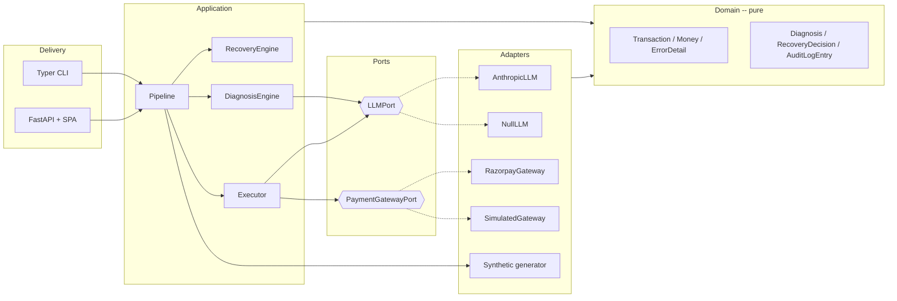

# Architecture

## Shape

Ports and adapters (hexagonal). The recovery logic sits in the middle and
knows nothing about Razorpay, Anthropic, HTTP, or JSON files — it talks to
`typing.Protocol` ports that adapters implement.

## The five stages

| Stage | Module | Responsibility | AI? |
|---|---|---|---|
| Generate | `adapters/synthetic.py` | seeded Razorpay-shaped batch | no |
| **Diagnose** | `services/diagnosis.py` | root cause + first move | rule table; LLM for the one ambiguous case |
| **Decide** | `services/recovery.py` | bound the action under 3 hard limits | no — deterministic on purpose |
| **Execute** | `services/execution.py` | payment link / message + audit entry | LLM drafts copy only |
| Report | `domain/results.py` | derive every headline number | no |

`services/pipeline.py` runs Diagnose and Execute **concurrently** across
the batch (thread pool, default 16 workers) and Decide **sequentially** in
chronological order between them — the recovery engine is stateful and
must see events as they happened. A per-transaction raise in either
parallel phase is captured and never affects the rest. With a live LLM a
180-transaction batch runs in ~8 s instead of ~100 s.

## Why the rule/LLM split is where it is

Seven of the eight failure reasons have exactly one correct response
regardless of context (`card_expired` → ask for a new card; `risk_check_failed`
→ stop). A model call there adds latency and a hallucination surface for no
judgement benefit. Only a **bare bank decline** (`payment_declined`, no
sub-reason) is genuinely context-dependent — retry vs. wait vs. switch method
depends on attempt history and amount — so that one reason, plus any rule
whose confidence is below a floor, is routed to the LLM. The LLM returns a
*recommendation*; `RecoveryEngine` still enforces every stopping rule on top.

If there is no Anthropic key the route still happens — into a conservative
deterministic fallback (`method="llm_fallback"`), never a crash.

## The stopping rules (enforced in `services/recovery.py`)

1. **`do_not_contact` is absolute.** No branch can turn it into an action.
   A property-style integration test regenerates a fresh 400-transaction
   batch on a different seed and asserts this holds end-to-end.
2. **Retries capped per method.** `card` allows 3 attempts, `netbanking` 2
   (usually a bank outage — retrying is pointless). Past the cap, escalate to
   `request_update` and suggest the method's alternate rail.
3. **Contact capped per customer.** ≤ 2 messages in a rolling 48 h, across all
   the customer's transactions. Silent retries never count. The engine is
   stateful and processes the batch in time order, so the cap is enforced
   against real prior history, not per-transaction in isolation.

## Money

`domain/money.py` — an exact `Decimal` under the hood, `int` paise on the
Razorpay wire, and Indian digit grouping in every rendering (`₹1,23,45,678`,
not `₹12,345,678`). Pydantic integration means models carry `Money` directly.

## Projected vs. confirmed recovery

A batch has no real customer completing checkout, so conversion is
**projected**: a published probability per action type (`RETRY_NOW` 0.45 …
`REQUEST_UPDATE` 0.15), drawn with a per-transaction seed so re-runs match.
`POST /api/webhooks/razorpay` models the production replacement — a
`payment_link.paid` event flips one entry's `confirmed_outcome`, and the
dashboard's "confirmed" number moves.
